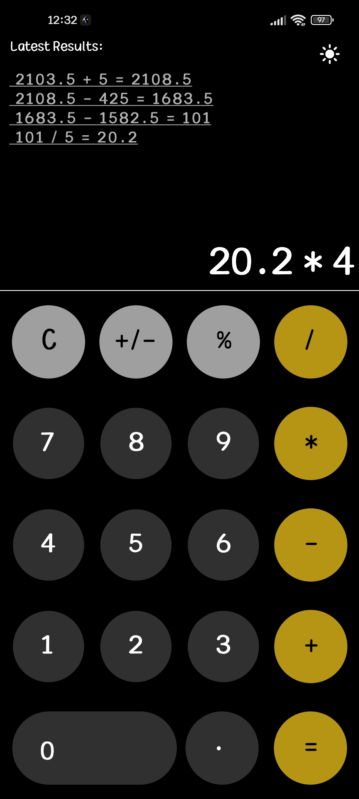
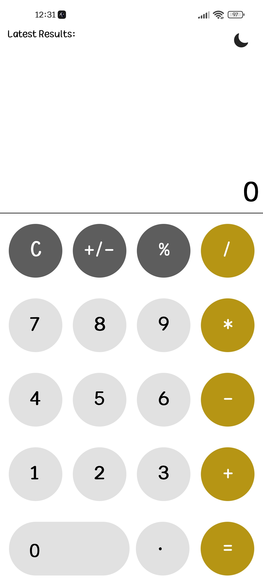
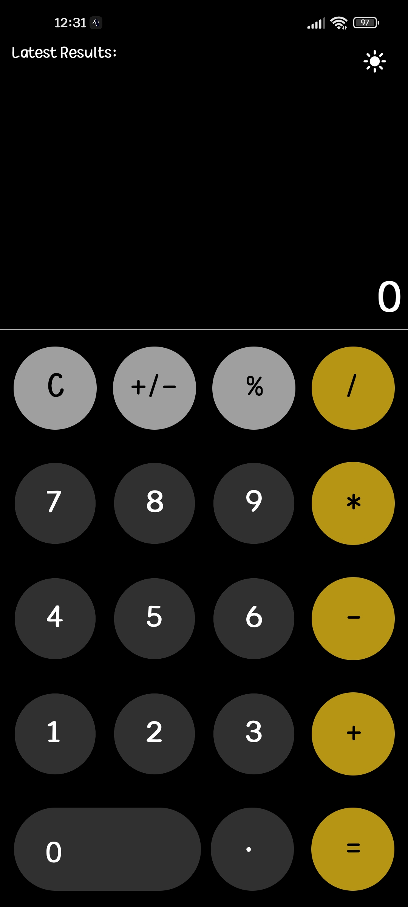
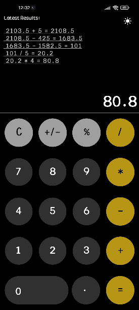

# Calculator
A very simple calculator made with React Native and Expo.
The Calculator has the ability to add, subtract, multiply, divide and even work with percentages.
It supports dark and light mode.

   
